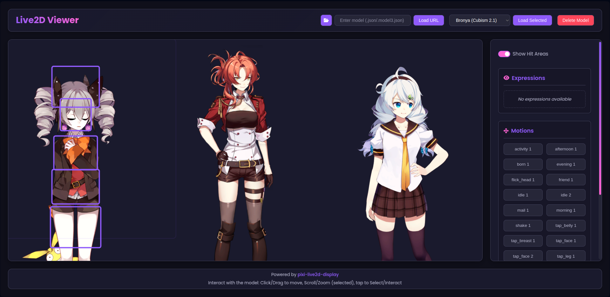
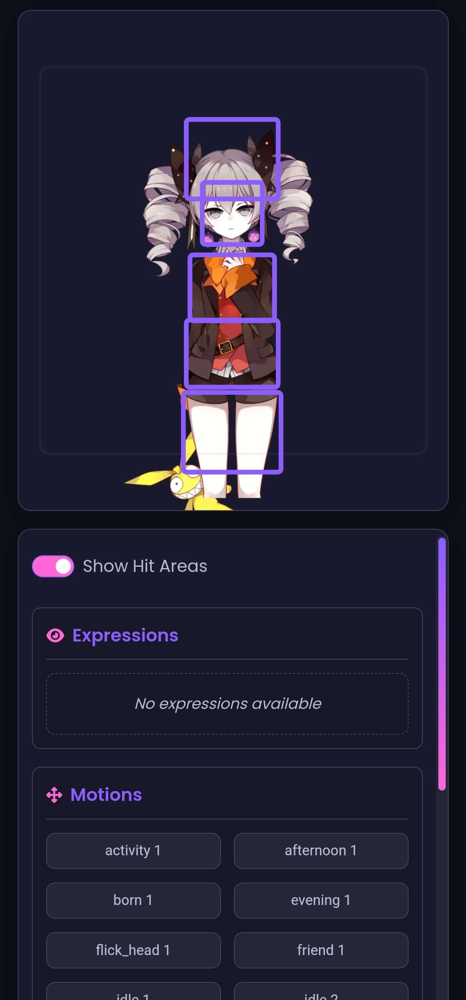
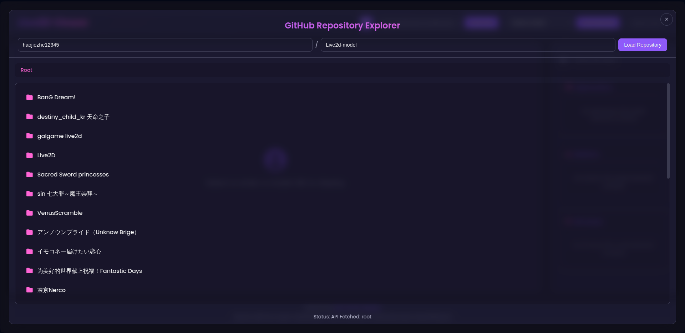
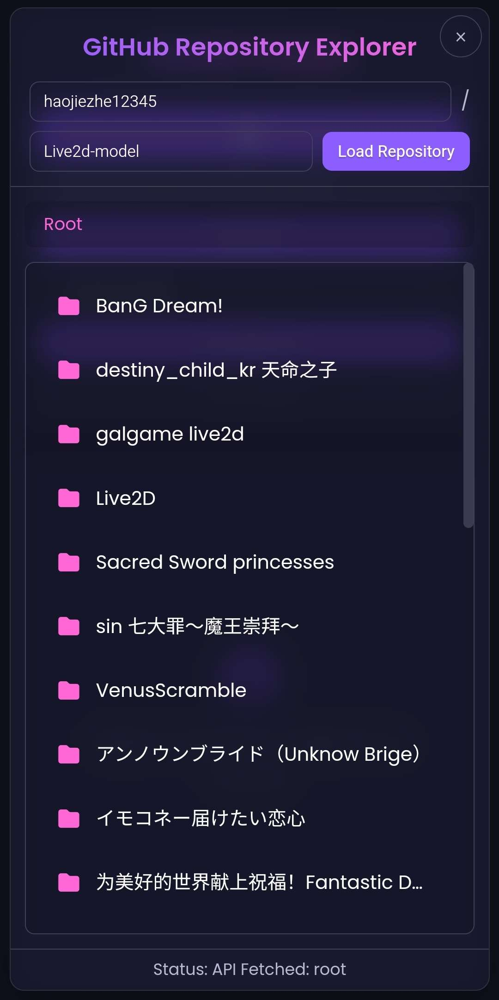
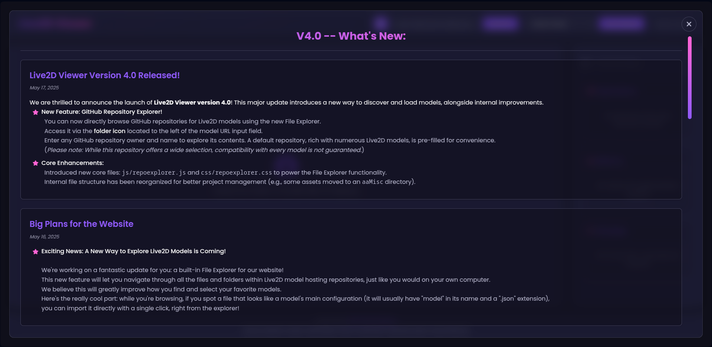
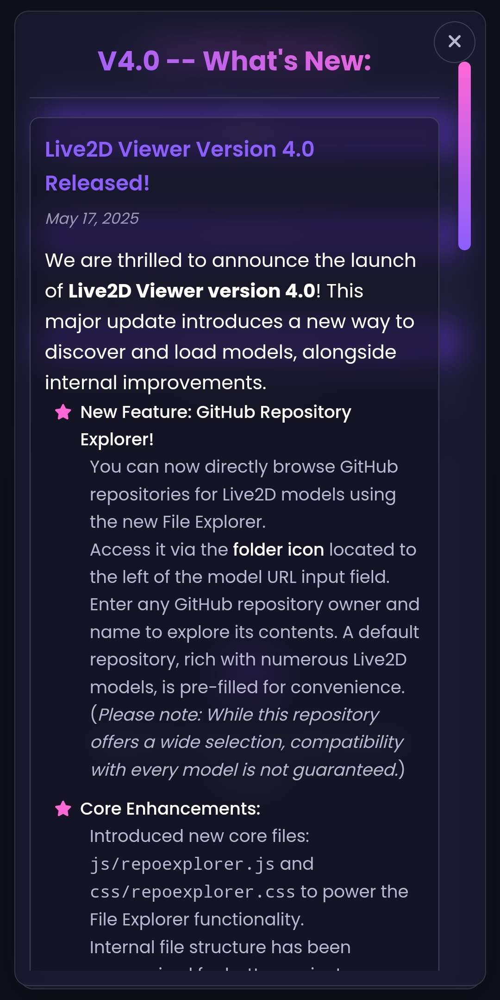

#  Live2D Viewer  

[](LICENSE)
[](https://imduck42.github.io/Live2D-Viewer/)
&nbsp;&nbsp;&nbsp;[](index.html)
[](css)
[](js)

A decently performant, browser-based Live2D viewer designed for interaction with one or more Live2D models. Built with vanilla JavaScript and the PIXI.js rendering engine.  
This project offers a feature-rich experience without the overhead of heavy frameworks.

It includes a dynamic UI, multi-model support, a GitHub repository explorer for discovering new models, and a "What's New" changelog modal, all wrapped in a clean, responsive design.

---

## Live Preview

### **[https://imduck42.github.io/Live2D-Viewer](https://imduck42.github.io/Live2D-Viewer)**

<details>
    <summary><strong>Screenshots</strong></summary>
    <p align="left">
        
        
    </p>
    <p align="left">
        
        
    </p>
    <p align="left">
        
        
    </p>
</details>

---

## Features

-   **Multi-Model Support**: Load, view, and interact with multiple Live2D models on the same canvas.
-   **Intuitive Controls**:
    -   **Drag** to pan models.
    -   **Pinch** or **Scroll** to zoom.
    -   **Tap** on hit areas to trigger motions.
-   **Dynamic UI Panel**: A responsive sidebar provides real-time control over expressions, motions, and hit-area visibility for the selected model.
-   **GitHub Repository Explorer**: An integrated file explorer to browse GitHub repositories, preview model files, and import them directly using the jsDelivr CDN.
-   **Changelog Modal**: A sleek, glassmorphism-style modal that holds and displays the latest project updates from `changes.html`.
-   **Responsive Design**: A fluid layout that adapts seamlessly to both desktop, tablet and mobile devices.
-   **Framework-Free**: Built with pure, well-organized JavaScript, css and html ensuring a lightweight and transparent codebase.
---

## Technology Stack

-   **Rendering**: [PIXI.js](https://pixijs.com/) v6.5.8
-   **Live2D Integration**: [pixi-live2d-display](https://github.com/guansss/pixi-live2d-display) v0.4.0
-   **Core SDK**: Live2D Cubism Core
-   **Icons**: [Font Awesome](https://fontawesome.com/) v6.5.2
-   **Languages**: HTML5, CSS3, JavaScript (ES6+)
-   **CDN**: [jsDelivr](https://www.jsdelivr.com/) for fetching repository files.

---

## File Structure

The project is organized into a clear and maintainable structure:

```
.
├── assets/
│   ├── icon.svg
│   ├── changes.html
│   └── screenshots/
├── css/
│   ├── styles.css
│   ├── repoexplorer.css
│   └── newsmodal.css
├── js/
│   ├── script.js
│   ├── repoexplorer.js
│   └── newsmodal.js
├── libs/
│   ├── live2d.js
│   ├── live2dcubismcore.js
│   └── extra.js
├── index.html
├── README.md
├── LICENSE
└── zToDo.txt
```

---

## Installation

To run the viewer locally, follow these steps:

1.  **Clone the repository:**
    ```bash
    git clone https://github.com/ImDuck42/Live2D-Viewer.git
    cd Live2D-Viewer
    ```

2.  **Open in a browser:**
    You can open `index.html` directly in a modern browser.

3.  **(Recommended) Serve locally:**
    For best results and to avoid potential CORS issues when loading models, run a local web server.
    ```bash
    # If you have Python 3 installed:
    python3 -m http.server

    # Then, open http://localhost:8000 in your browser.
    ```

---

## Usage

1.  **Load a Model**:
    -   **URL Input**: Paste the URL of a `model.json` or `.model3.json` file and click "Load URL".
    -   **Default Models**: Choose a pre-configured model from the dropdown and click "Load Selected".
    -   **File Explorer**: Click the **folder icon** in the header to open the GitHub Repository Explorer. Browse for models and import them with a single click.

2.  **Interact with the Model**:
    -   **Select**: Tap a model to select it. The control panel will update accordingly.
    -   **Move**: Drag the selected model to reposition it.
    -   **Zoom**: Use the mouse wheel or pinch gestures to zoom in and out.
    -   **Trigger Motions**: Tap on a model's hit areas (like the head or body) to play associated motions.

3.  **Use the Control Panel**:
    -   **Show Hit Areas**: Check the box to visualize the model's interactive hit zones.
    -   **Expressions & Motions**: Click buttons in the corresponding sections to apply expressions or play animations.
    -   **Delete Model**: Click the trash icon to remove the currently selected model from the canvas.

---

## Contributing

Contributions are welcome! If you have ideas for improvements or find a bug, please feel free to:

1.  **Open an Issue**: Describe the issue or feature proposal in detail.
2.  **Submit a Pull Request**: Fork the repository, make your changes, and submit a PR with a clear description of your work.

Please adhere to the existing code style and add comments where possible.

## License

This project is licensed under the **MIT License**. See the [LICENSE](LICENSE) file for details.